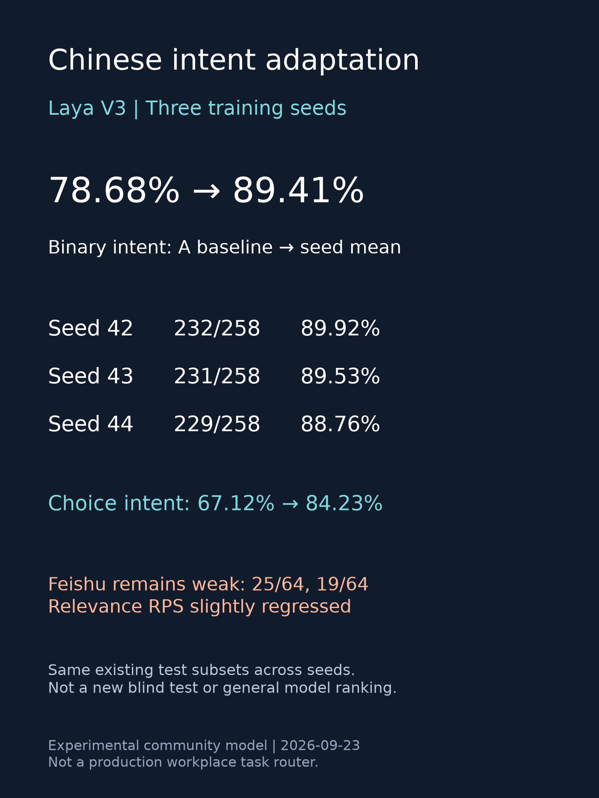

# Chinese intent adaptation of Laya: three-seed results and workflow limitations

A Chinese-first, bilingual post-training experiment on the historical Laya multilingual checkpoint. This is an independent community contribution, not an official release or a claim of partnership. The useful result is intent adaptation; **Feishu task routing remains inadequate**.

[中文报告](README.zh-CN.md) · [Existing Feishu benchmark](https://github.com/Adkid-Zephyr/chinese-workflow-decision-bench)

## Results

Same CUDA/BF16 evaluation, fixed existing test subsets. The original Laya column uses the historical multilingual checkpoint, not current upstream main. A is the intermediate post-trained baseline, not original Laya.

| Model | Chinese binary intent (258) | Chinese choice intent (222) |
|---|---:|---:|
| Original Laya multilingual | 177/258 (68.60%) | 96/222 (43.24%) |
| Intermediate A | 203/258 (78.68%) | 149/222 (67.12%) |
| V3 seed42, selected candidate | 232/258 (89.92%) | 188/222 (84.68%) |
| Same recipe seed43 | 231/258 (89.53%) | 187/222 (84.23%) |
| Same recipe seed44 | 229/258 (88.76%) | 186/222 (83.78%) |

Three-seed means: **89.41% binary / 84.23% choice**, sample SD0.59/0.45 percentage points. Repeated training on the same panel does not increase the number of independent test examples. These subsets were used previously in the project, are not a new blind test, and choice is not the full60-label benchmark. Simplified/traditional Chinese share semantic IDs. No statistical-significance or general model-ranking claim.

## What changed

95,708 original-label training judgements from MASSIVE (30,264 zh-CN/zh-TW/en-US), CrossWOZ (29,986), and T2Ranking (35,458). Deterministic transformations add Chinese intent descriptions, positive/negative intent matching, target-message JSON with same-split distractors, and query/document JSON. See [transform.py](transform.py) and [source/licensing notes](DATA_SOURCES.md). No private chats or Feishu benchmark examples were trained on; no LLM-generated gold labels were added.

The chain is original multilingual Laya → intermediate A → V3. V3 updates54,892,033 parameters: last8 encoder blocks/final norm and decision components. Encoder LR1e-5, head LR1e-4, batch64/microbatch8,2 full epochs/2991 updates, plus0.5-weight T2 RPS loss. Preflight200 steps and qualification20k examples each reset to A before the next stage. A separate development rule requires >=5pp binary-Chinese gain while limiting original-task accuracy/F1 drops to3pp and RPS increase to0.015. V3seed42 was selected by tune metrics before final evaluation; seeds43/44 only replicate it, never replace it by best test score.

## What did not improve

On original-format T2 official-dev labelled pairs (n1600), RPS (lower better) worsened from A0.21677 to0.22366/0.22496/0.22326. Original-format CrossWOZ micro-F1 fell slightly from A0.9488 to0.9452/0.9452/0.9474. Passing development tolerance is not absence of regression.

Feishu is a communication/collaboration application used in Chinese workplace workflows. The existing synthetic64-case diagnostic represents task ownership, cancellation/completion, urgency and useful information; it does not test the Feishu platform or represent an official benchmark. **V3 scored25/64 direct choice and19/64 four-question composition.** Direct choice falsely assigned23/32 non-action cases; composition missed30/32 actionable cases despite zero false assignments. This is not a production Feishu task selector or a Jev replacement. No additional API calls were made for this contribution.

## Offline audit

```bash
python audit.py
python -m unittest discover -s . -p 'test_*.py'
```

Python stdlib only; no weights, downloads or API key. The archive contains31,200 prediction rows and128 Feishu responses. It validates frozen file hashes, model-to-model ID/gold/candidate alignment, denominators, finite probabilities, accuracy/F1/RPS, and Feishu decoding/error counts. The row total spans tasks/models and is not31,200 independent test samples. Predictions contain original dataset identifiers/labels, not source utterances. Dataset attribution remains applicable.

## Model and reproducibility

Full FP32 weights have been reconstructed, with every tensor checked against A+V3 delta. CPU and MPS output checks for five requests per device exactly matched the archived two-part loader. This is a smoke test, not full backend equivalence or a speed leaderboard. The wrapper uses a512-token head budget; this archived Feishu run used256. Probabilities are not calibrated for a new domain; the frozen action head is not exposed as a reliable abstention signal.

The full merged FP32 model is now public as [Laya-CN-A on Hugging Face](https://huggingface.co/Adkid/laya-cn-a), revision `97f1604aca185393887b9a5cc78380fdb008f4a4`. The Hub weight SHA256 matches the exported A+V3 checkpoint (`f24d658960f88c45497bc71064db57b9046bedd77f1f56c773b5e0041008d6a7`). Download it for local prediction with the model repository’s `predict.py`; the model card explains the tested environment.

[Source and weight hashes](SOURCE.json). Upstream code/weights attribution: Convai Innovations and Laya contributors, Apache-2.0. Prepared with OpenAI Codex assistance. Training recipes and negative outcomes are retained; a fresh-machine full retraining replay has not been independently executed.


