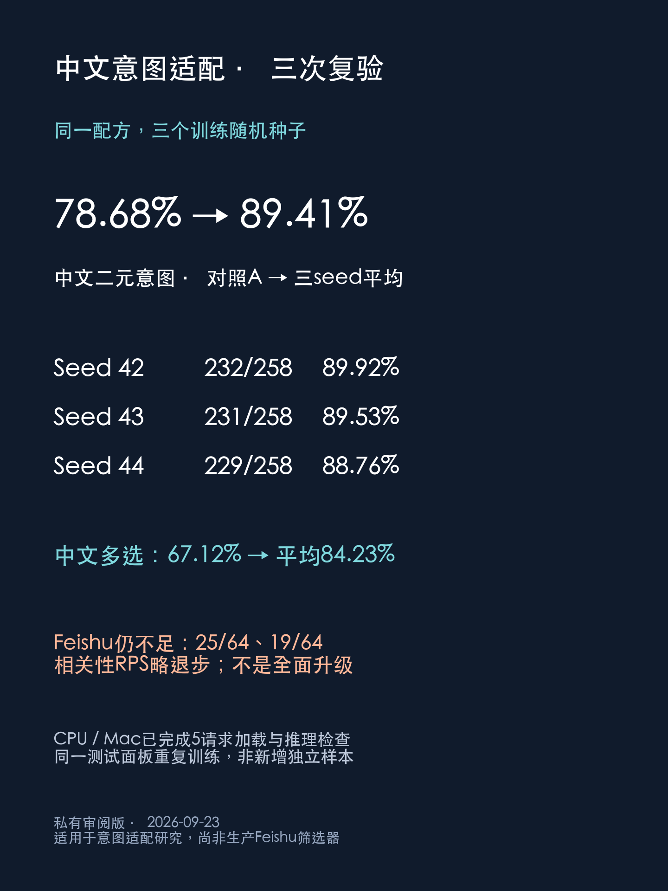

# Laya中文意图后训练：三种子结果与Feishu应用限制

独立社区实验。基于历史多语言权重，不是当前main成绩，也不表示官方联合开发。

| 模型 | 中文二元意图 | 中文多选意图 |
|---|---:|---:|
| 原Laya | 177/258（68.60%） | 96/222（43.24%） |
| 中间后训练A | 203/258（78.68%） | 149/222（67.12%） |
| V3 seed42 | 232/258（89.92%） | 188/222（84.68%） |
| 同配方seed43 | 231/258（89.53%） | 187/222（84.23%） |
| 同配方seed44 | 229/258（88.76%） | 186/222（83.78%） |

三种子平均89.41%/84.23%。这不是三种方法，而是固定配方改变随机种子；保留原先按开发集规则选出的seed42，没有挑测试最高的种子。面板此前在项目中使用，非新盲测；多选非完整60类别；重复训练不增加独立测试样本。

原始标注95,708条，来自MASSIVE、CrossWOZ、T2Ranking。保留标签，做中文意图描述、二元意图匹配、带目标ID/干扰消息的结构化输入。V3在A基础上解冻最后8层及决策部分，训练2轮/2991步；没有训练Feishu评测题，也没有新造LLM答案。

**应用层仍未成功。** Feishu（飞书）是中国日常工作中使用的沟通协作软件。借用其群消息场景评估“谁该做、还要不要做、急不急”，不评测平台本身，也不是官方标准。V3单选25/64、四问19/64；四问漏掉30/32个行动案例，不能作为可靠待办筛选器。相关性T2 RPS以及原格式对话行为F1也略退步，详见[英文报告](README.md)。

离线复核只需Python，不需模型或API：

```bash
python audit.py
```

包含逐条概率、标签、固定哈希、分母与误分派/漏任务审计。输入源不是私人聊天；Feishu案例是合成场景，输出是真实调用结果。

完整权重已导出并通过CPU/MPS样例一致性检查。完整模型已公开：[Hugging Face：Laya-CN-A](https://huggingface.co/Adkid/laya-cn-a)，固定版本 `97f1604aca185393887b9a5cc78380fdb008f4a4`。训练和评测局限、来源与许可见英文报告及DATA_SOURCES.md。


